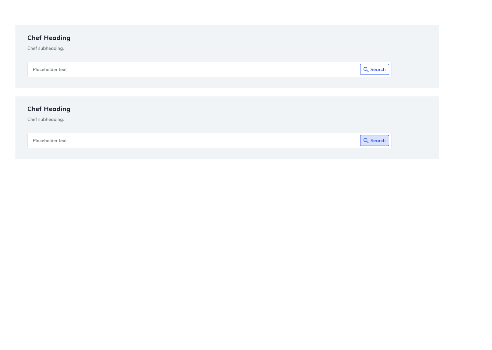

## Welcome to the front-end developer code test!
The purpose of this take-home test is to help us gain an understanding for the way you architect your code, your code style, and your process.
As part of the interview process, you will be reviewing your code with two engineers from Chef.
During this time, you will be expected to explain choices you made when coding.


## The code test project: what to do & technical details
Build a GUI to display and filter the information returned by the provided `nodes` endpoint.
This should include:
* a table
* filter search bar, created in accordance with the included mock

What we're looking at when evaluating your code project:
* data flow models
* accessibility

You can choose whatever framework(s) you'd like to do your work, including none. 
Please include some details on how to run your code. This can be in a README, Makefile, whatever you'd like.


## Running the go app
We've included a small golang binary that will serve up some static data for the code test. This go binary can be run using docker or by running the golang binary directly.


### run it with docker:

TODO

### run the go binary directly:
* install golang (https://golang.org/doc/install)
* clone the repo to your local /go/src dir
* cd to /go/src/code-test
* `go run main.go`

< Note: if you have trouble getting the golang app up and running, please contact us right away so we can unblock you >


## sample api calls
```
curl http://127.0.0.1:2133/nodes -d '{}'
curl http://127.0.0.1:2133/nodes -d '{"filters": [ { "key": "last_scan_status", "value": "failed" } ] }'
curl http://127.0.0.1:2133/nodes -d '{"filters": [ { "key": "name", "value": "my test node" } ] }'
```


## the searchbar mock



